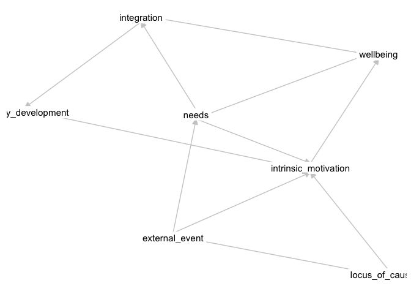

Untitled
================
25 July, 2025

This manuscript uses the Workflow for Open Reproducible Code in Science
(Van Lissa et al. 2021) to ensure reproducibility and transparency. All
code <!--and data--> are available at <worcs_workflow>.

This is an example of a non-essential citation (Van Lissa et al. 2021).
If you change the rendering function to `worcs::cite_essential`, it will
be removed.

<!--The function below inserts a notification if the manuscript is knit using synthetic data. Make sure to insert it after load_data().-->

## GitHub Documents

This is an R Markdown format used for publishing markdown documents to
GitHub. When you click the **Knit** button all R code chunks are run and
a markdown file (.md) suitable for publishing to GitHub is generated.

## Including Code

You can include R code in the document as follows:

``` r
library(ggplot2)
df_plot <- study_results
df_plot$beta <- ordered(df_plot$beta)
ggplot(df_plot, aes(x = n, y = power, color = beta, shape = beta)) +
  geom_point() +
  geom_line() +
  theme_bw()
```

    ## Warning: Using shapes for an ordinal variable is not advised

<!-- -->

## Including Plots

You can also embed plots, for example:

    ## Warning: Using shapes for an ordinal variable is not advised

<!-- -->

Note that the `echo = FALSE` parameter was added to the code chunk to
prevent printing of the R code that generated the plot.

``` r
sdt <- dagitty::dagitty(paste(readLines("../theory/sdt.txt"), collapse = "\n"))
sdt
```

    ## dag {
    ## external_event
    ## healthy_development
    ## integration
    ## intrinsic_motivation
    ## locus_of_causality
    ## needs
    ## wellbeing
    ## external_event -> intrinsic_motivation
    ## external_event -> locus_of_causality
    ## external_event -> needs
    ## integration -> healthy_development
    ## integration -> wellbeing
    ## intrinsic_motivation -> healthy_development
    ## intrinsic_motivation -> wellbeing
    ## locus_of_causality -> intrinsic_motivation
    ## needs -> integration
    ## needs -> intrinsic_motivation
    ## needs -> wellbeing
    ## }

``` r
tidySEM::graph_sem(sdt)
```

<!-- -->

<div id="refs" class="references csl-bib-body hanging-indent"
entry-spacing="0">

<div id="ref-vanlissaWORCSWorkflowOpen2021" class="csl-entry">

Van Lissa, Caspar J., Andreas M. Brandmaier, Loek Brinkman, Anna-Lena
Lamprecht, Aaron Peikert, Marijn E. Struiksma, and Barbara M. I. Vreede.
2021. “WORCS: A Workflow for Open Reproducible Code in Science.” *Data
Science* 4 (1): 29–49. <https://doi.org/10.3233/DS-210031>.

</div>

</div>
